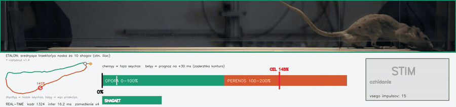
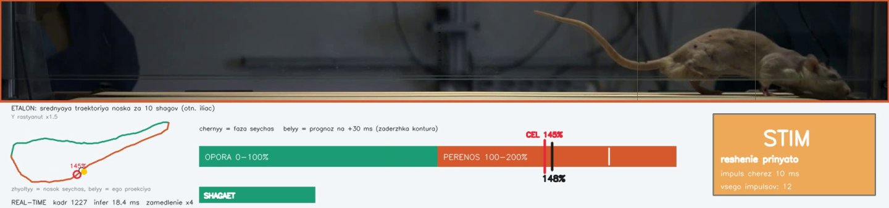
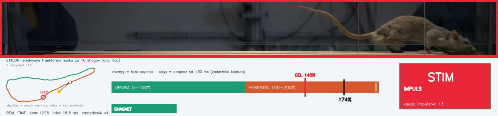

# Процент фазы шага и поджиг стимула

Состояние на 15.08.2026. Постановка О.В. Горского, реализация и измерения.

## Задача

Стимул нужно подавать не «в опору» или «в перенос», а в **конкретную точку цикла**.
Соглашение: опора это 0…100%, перенос 100…200%. Процент считается **внутри каждой
фазы отдельно**, поэтому шкала не линейна по времени: при опоре 295 мс и переносе
95 мс один процент опоры стоит 2.95 мс, а один процент переноса 0.95 мс. Требования
к точности в переносе втрое жёстче, и это надо держать в голове при чтении любых
цифр ниже.

Метод, как он был предложен: строить усреднённую за последние N шагов траекторию
носка относительно iliac (относительно тела, чтобы не зависеть от движения дорожки),
приписать каждой точке траектории процент, и определять текущий процент как процент
ближайшей точки.

## Как это выглядит



Слева эталонная петля с меткой цели, жёлтая точка это носок сейчас, белая её
проекция. На шкале чёрный бегунок это текущая фаза, белый прогноз на задержку
контура. Плашка оранжевая в момент решения, красная в момент импульса.

| Решение принято | Импульс |
|---|---|
|  |  |

Между этими кадрами 30 мс: решение принимается заранее, потому что столько идёт от
физического движения до реакции контура.

## Метрики на сегодня

Реальный поток, вся запись 15 687 кадров, интактная крыса, цель 145%.

| | значение |
|---|---|
| попадание в цель, медиана | **+0.5% (0.5 мс)** |
| разброс p90 | **10.6% (11.1 мс)** |
| покрытие циклов | 100% |
| импульсов на стоянке | 0 |
| частота контура | 55 Гц |

Задержка по стадиям, медиана / p95, мс:

| стадия | медиана | p95 |
|---|---|---|
| чтение кадра | 1.3 | 1.7 |
| инференс DLC | 18.0 | 21.9 |
| детектор событий | 0.18 | 0.69 |
| **процент фазы** | **0.33** | 0.45 |
| итого контур | 18.4 | 22.4 |

**Геометрия стоит 0.33 мс, это 1.8% цикла.** Внедрение метода по вычислениям
практически бесплатно, всё время по-прежнему съедает инференс.

Сверка с офлайном на одном и том же окне записи даёт p90 9.8% против 9.8%, то есть
каузальность и живой инференс не стоят ничего по точности.

## Где предел точности

Разброс переноса от шага к шагу: медиана 105 мс, SD 15 мс, от 85 до 124 мс. Если
целиться в 45% переноса по медианной длительности, одна эта изменчивость даёт
p90 = 10.6%. Система выдаёт 10.6%. **То есть разброс определяется животным, а не
контуром**, и дальнейшая оптимизация сенсорной части ничего не даст.

Опора гуляет впятеро сильнее (SD 79.6 мс на медиане 295), поэтому целиться в процент
опоры смысла мало.

## Достижимые проценты

Раньше 137% в перенос попасть нельзя: это первые 39 мс переноса, а столько уходит на
инференс и детектор. Строки 105% и 110% сваливаются в одно место около 137%.
Лучшая зона это 130…160%, разброс 12…17 мс.

Сокращение задержки контура с 39 до 28 мс (медиана детектора с 3 кадров до 1)
опускает порог до ~129%, но **точность на 145% при этом не меняется**: там задержка
и так с запасом.

## Три поправки, без которых не работает

1. **Лаг событий протекает в разметку эталона.** Детектор сообщает об отрыве с
   опозданием на кадр. Геометрия петли снимается верно, а ярлыки на ней съезжают:
   точка «100%» оказывается там, где перенос уже начался. Смещение выходило +9.5%,
   ровно кадр. Компенсация: события относятся назад на `event_lag` кадров.
   Симметрия подтверждает диагноз: 0 кадров даёт +9.5%, 1 кадр +0.5%, 2 кадра −8.6%.

2. **Поджиг с поправкой на полшага.** Прогноз идёт скачками по ~10% фазы за кадр, и
   правило «первый кадр, где прогноз перевалил за цель» систематически перелетает на
   половину кадра. Смещение +5.0% против −0.6% после поправки.

3. **Не сглаживать координату.** Каждый кадр медианы добавляет свой лаг, который
   никто не компенсирует. Разброс p90 при окне 1/3/5: 9.8 / 17.6 / 24.0%.

## Найденный баг: оценка скорости ленты

`estimate_belt_velocity` брала медиану **нижней** половины распределения скоростей и
тем самым молча предполагала, что лента везёт носок в −x. На камере с другой стороны
дорожки носок в опоре едет в +x, и оценка цепляла кластер переноса: на записи 4
давала −28 px/с вместо +439.

Разметка при этом **не падала, а выдавала правдоподобный мусор**: 57 «постановок»
вместо 244, цикл 685 мс вместо 390.

Пострадало **5 записей из 12** (4, 7, 8, 16, 17). Заменено на поиск моды гистограммы,
направление не важно. На синхронной паре камер модуль оценки теперь сходится: 439 и
447 px/с при противоположных знаках, отношение 0.98.

## Двусторонняя съёмка

Попутно выяснилось, что камеры 174 и 175 смотрят **с разных сторон** дорожки (крыса
на кадрах зеркальна) и синхронизированы кадр в кадр: по общим точкам тела корреляция
r = 1.000 при нулевом лаге. Значит каждая видит свою ближнюю лапу.

Межконечностный сдвиг измерен: **0.486 цикла** на 238 циклах, асимметрия опоры 3.4%.
Это measured normal для интактного животного, с которым сравнивать результат
стимуляции.

Важно для настройки: метки `l`/`r` у модели **экранные, а не анатомические**.
Переворот кадра одной камеры превращает её `l` в `r`. Физическую сторону надо
закреплять номером камеры, метке модели доверять нельзя.

## Как мерить правильно

Трижды подряд мнимый дефект оказывался артефактом измерения. Записываю грабли, чтобы
не наступать снова.

**Не сравнивать покрытие с офлайн-разметчиком.** Он не даёт метки на 38% записи,
причём в 62% этих кадров крыса движется. Метрика «импульсы там, где разметчик
молчит» меряет полноту разметчика, а не работу системы. Из-за неё я дважды
отчитался о несуществующих дефектах: «стреляет по стоящей крысе» (на самом деле 0
импульсов при выключенном признаке движения) и «14% лишних импульсов» (на самом деле
двойных срабатываний ноль).

**Считать импульсы по номерам шагов, а не по кадрам.** И помнить, что счётчик циклов
не увеличивается на паузах: три «двойных срабатывания» оказались импульсами,
разделёнными 0.5, 4.6 и 21 секундой.

**Эталон для сравнения не должен совпадать с проверяемым методом.** Сравнение
геометрии с таймером сначала было нечестным: «истинный» процент я определял как долю
прошедшего времени и с ним же сравнивал таймер. Таймер выиграл по построению.

## Геометрия против таймера

На интактной крысе на тредмиле эти определения почти совпадают, расхождение не более
5.4%, разброс позы в момент поджига одинаковый. Причина физическая: в опоре лента
тащит стопу с постоянной скоростью, поэтому равные интервалы времени это равные
отрезки пути.

Разница не в точности, а в том, **что нужно каждому методу в момент работы**:

| потеря событий | таймер | геометрия |
|---|---|---|
| 0% | 100% импульсов | 98% |
| 25% | 74% | 98% |
| 50% | 51% | 98% |
| 75% | 27% | 98% |

Таймеру нужно свежее событие каждый цикл. Геометрии нужна только эталонная петля,
которая пересобирается раз в цикл. На интакте события ловятся с recall 99% и разницы
нет; после гемисекции шаг развалится, и вот тогда она станет решающей.

Скользящее обновление эталона обязательно: замороженный по первым 10 циклам эталон
отстаёт втрое уже внутри одной записи (невязка 19.0 px против 6.1 px). Причём первые
циклы записи это худшая выборка, крыса ещё не вошла в устойчивый шаг.

## Открытая задача: выходное плечо

**Измерена только первая половина задержки.** От движения ноги до решения это 28–29 мс,
померено. От решения до тока в электроде не померено **ничего**.

Программная часть снята: упаковка DDLP 0.064 мс, sendto 0.088 мс, транспорт UDP
0.031 мс, **итого 0.18 мс**. Это ничто.

Дорого стоит другое. В плагине `emitPendingTtlState()` вызывается из `process()`, то
есть **поблочно**. Пакет приходит на сокетном потоке в любой момент, а TTL встаёт в
начало следующего блока (при одном слове в очереди `sampleIndex = 0`). Значит
задержка равна времени до начала следующего блока: равномерно от нуля до длительности
блока.

| блок, отсчётов | при 30 кГц | средняя | джиттер (СКО) | в % фазы |
|---|---|---|---|---|
| 128 | 4.3 мс | 2.1 мс | 1.2 мс | 2.2% |
| 256 | 8.5 мс | 4.3 мс | 2.5 мс | 4.5% |
| 512 | 17.1 мс | 8.5 мс | 4.9 мс | 9.0% |
| 1024 | 34.1 мс | 17.1 мс | 9.9 мс | 18.0% |

**Это не только сдвиг, это джиттер.** Сдвиг калибруется, мы просто целимся раньше.
Разброс нет: момент прихода пакета не синхронизирован с тактом блоков. При блоке 1024
джиттер выходного плеча 9.9 мс против нашего нынешнего разброса 11.1 мс, то есть
точность упадёт примерно вдвое.

**Размер буфера Open Ephys становится параметром системы, а не настройкой записи.**

Что надо сделать:

- [ ] измерить фактический размер блока на установке;
- [ ] измерить осциллографом путь TTL → ток в электроде (или взять из документации STG);
- [ ] решить: минимальный буфер или обход Open Ephys для триггера (отдавать его из
      Python прямо на вход стимулятора либо через USB-DAQ; тогда блочная квантизация
      исчезает и остаются наши 0.18 мс).

## Интеграция в боевой мост

Перенесено в `single_rt_dlc_live_bridge.py`. Обвязка это `gait_phase_trigger.py`,
класс `PhaseTrigger`: читает конфиг, держит детектор и оценщик процента, отдаёт
мосту один булев ответ на кадр. Вся физика осталась в исходных классах.

В горячем цикле добавлена стадия между инференсом и отправкой, она видна в
профайлере отдельной строкой `phase`. По умолчанию `PHASE_TRIGGER_ENABLED = False`,
то есть поведение контура не меняется, пока триггер не включат.

### Работает только в режиме `ttl`, и это не прихоть

Плагин держит **одно** восьмибитное TTL-слово и пересобирает его целиком из
каждого пришедшего пакета:

```cpp
ttlWord = 0;
for (int line = 0; line < 8; line++)
    if (nextStates[line]) ttlWord |= 1 << line;
```

Для бинарных pose-пакетов состояния линий вычисляет сам плагин из позы. Значит
бит, выставленный отдельным пакетом от Python, будет погашен уже следующим
кадром. Отправить триггер «сбоку», не трогая C++, нельзя.

Поэтому фазовый триггер требует `DUAL_OE_BRIDGE_PACKET_MODE = "ttl"`, где слово
формирует Python. `PhaseTrigger` при старте предупреждает в логе, если режим
другой. Линии 0…3 заняты `has_triplet` и angle-триггером, фазовая по умолчанию 4.

Правильное решение на будущее это флаг в бинарном протоколе, чтобы триггер ехал в
том же пакете. Оно требует изменений в плагине и здесь не делалось.

### Настройки

Блок `PHASE_TRIGGER_*` в `config_dual_rt_dlc_live.py`. Ключевое:

| параметр | по умолчанию | смысл |
|---|---|---|
| `PHASE_TRIGGER_ENABLED` | `False` | пока выключено, контур прежний |
| `PHASE_TRIGGER_FPS` | `100.0` | **обязан совпадать** с частотой камеры |
| `PHASE_TRIGGER_LEG` | `"r"` | автовыбор не поддержан: эталон строится для конкретной ноги |
| `PHASE_TRIGGER_TARGET_PCT` | `145.0` | цель; раньше ~137% попасть нельзя |
| `PHASE_TRIGGER_TTL_LINE` | `4` | 0…3 заняты |
| `PHASE_TRIGGER_LATENCY_MS` | `28.0` | на столько экстраполируем фазу вперёд |
| `PHASE_TRIGGER_HOLD_FRAMES` | `2` | сколько кадров держать линию поднятой |

## Прочее незакрытое

- Всё измерено на **интактном** животном. После гемисекции: эталон на каждую крысу,
  межконечностный сдвиг заново, и повторить сравнение геометрии с таймером — там оно
  наконец станет содержательным.
- Сквозного прогона со стимулятором не было ни разу.

## Файлы

| файл | назначение |
|---|---|
| `python/realtime_phase_percent.py` | процент фазы в реальном потоке, класс `StreamingPhasePercent` |
| `python/realtime_phase_sim.py` | потоковый детектор событий, копия боевого скользящего ROI |
| `python/gait_phase_labeler.py` | офлайн-разметка stance/swing, эталон для сверок |
| `python/fire_at_percent.py` | карта достижимых процентов (`--sweep`) |
| `python/phase_robustness.py` | геометрия против таймера при потере событий |
| `python/phase_geometry_vs_time.py` | геометрический процент против временного |
| `python/phase_reference_drift.py` | нужно ли перестраивать эталон на ходу |
| `python/phase_percent_estimator.py` | офлайн-подбор пространства проекции |
| `python/export_stim_overlay.py` | видеовыгрузка с индикаторами |
| `python/sweep_detector_latency.py` | размен задержки и дребезга у детектора |
| `python/batch_offline_pose.py` | пакетный офлайн-инференс через DLCLive |
| `python/tests/test_gait_phase.py` | тесты, синтетика, GPU не нужен |

## Тесты

```
python -m pytest python/tests/test_gait_phase.py -q
```

30 тестов. Данные синтетические, GPU и записи не нужны, прогон около 8 секунд.
Почти каждый тест закрывает ошибку, которая уже случалась.

Проверено мутациями: если вернуть любой из багов на место, соответствующий тест
падает. Первая версия набора прошла с первого раза, и мутации показали, что два
теста из пяти были декоративными - поправку на полшага не видно на строго
периодической синтетике, а замороженный носок не двигает фазу и молчит без
всякого гейта. Оба переписаны.

Отдельно сверяется, что `realtime_phase_sim.LegRoiTracker` не разъехался с боевым
трекером из `single_rt_dlc_live_bridge.py`: класс достаётся из файла через `ast`,
без импорта самого моста (он тянет камеру и torch), и обе реализации прогоняются
по одной последовательности поз. Плюс проверка, что умолчания копии совпадают с
`LEG_ROI_*` в боевом конфиге.
