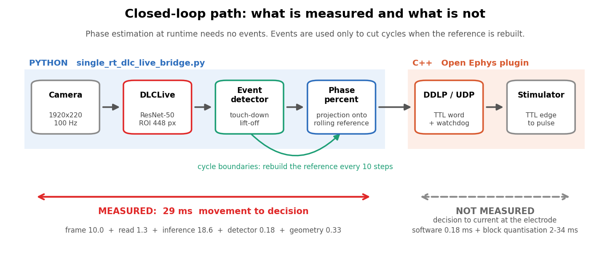
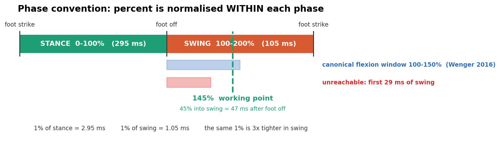
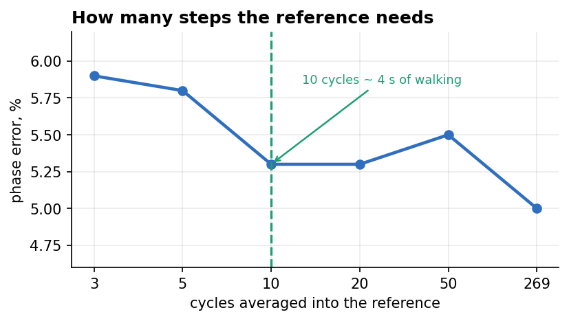
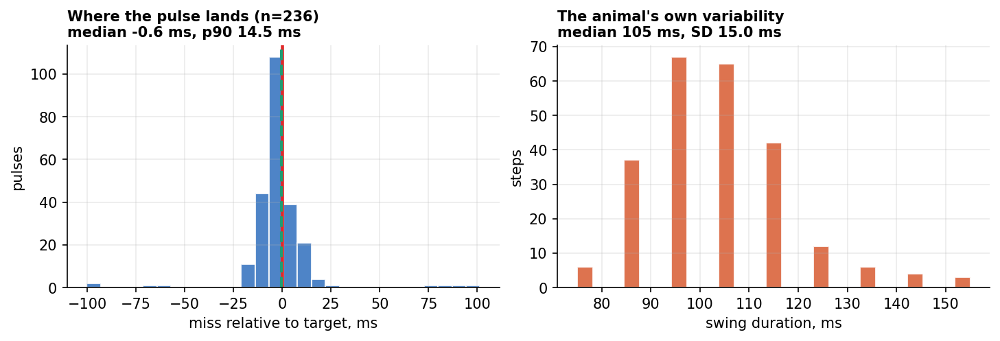
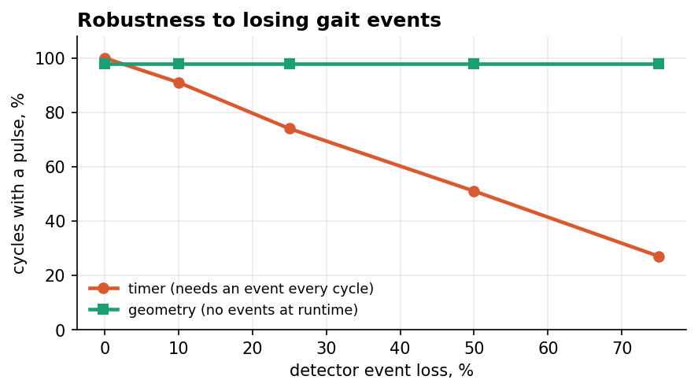
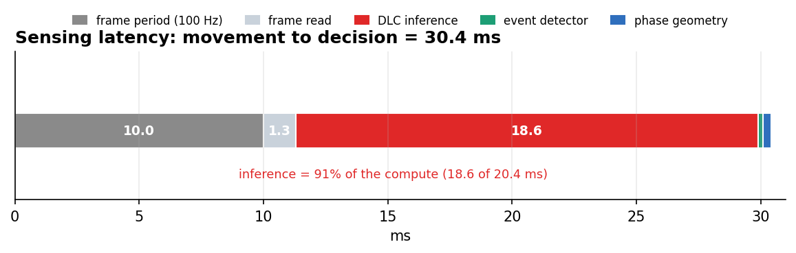
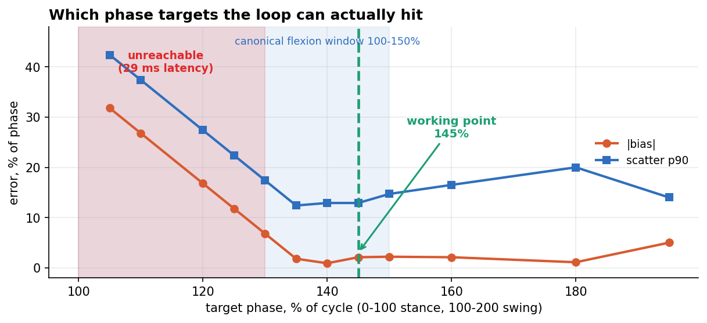
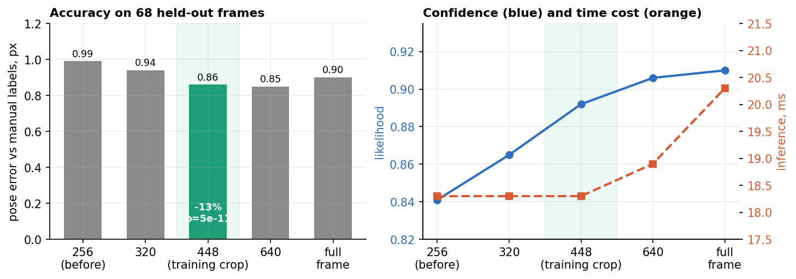
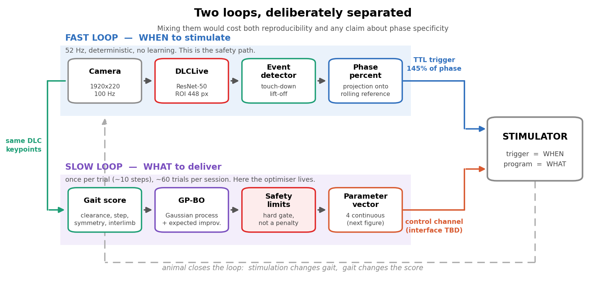
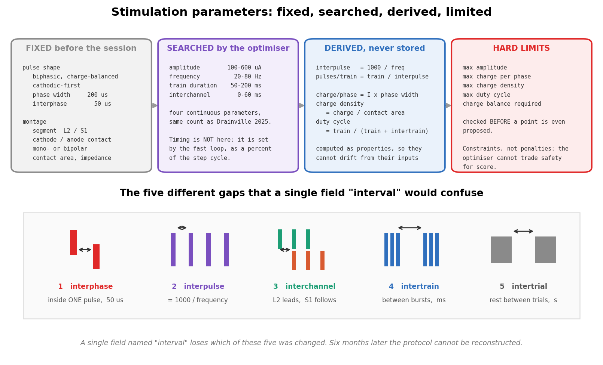

# Фазозависимая стимуляция: что построено и что измерено

Отчёт от 19.08.2026. Все числа получены измерением, источник каждого указан.
Рисунки собираются скриптами из `docs/figures_src/`.

---

## 1. Задача и архитектура

Стимул нужно подавать не «в опору» или «в перенос», а в **конкретную точку
цикла**. Постановка О.В. Горского: строить усреднённую за последние N шагов
траекторию носка относительно iliac (относительно тела, чтобы не зависеть от
движения дорожки), приписать каждой точке траектории процент фазы, и определять
текущий процент как процент ближайшей точки.

Ключевое свойство схемы: **в рантайме оценка процента не требует событий**.
События (постановка, отрыв) нужны только чтобы разрезать запись на циклы при
пересборке эталона, то есть раз в цикл. Этим геометрия отличается от таймера,
которому свежее событие нужно каждый цикл без исключения (раздел 6).

## 2. Соглашение о проценте

Процент считается **внутри каждой фазы отдельно**: опора это 0…100%, перенос
100…200%. Шкала не линейна по времени, и это принципиально для чтения всех цифр
ниже: при опоре 295 мс и переносе 105 мс один процент опоры стоит 2.95 мс, а
один процент переноса 1.05 мс. **Одна и та же ошибка в процентах в переносе
втрое жёстче по времени.**

## 3. Выбор пространства проекции

Наивная реализация «ближайшая точка по координате X» не работает: одно значение
X встречается за цикл дважды, носок проходит ту же точку назад в опоре и вперёд
в переносе. Проверено на 269 циклах:

| пространство проекции | ошибка, медиана | p90 | откатов фазы назад |
|---|---|---|---|
| только X | 13.0% | 79.3% | **38.6%** |
| X + Y, без нормировки | 6.2% | 17.2% | 3.2% |
| X + Y, с нормировкой | 6.0% | 18.9% | 3.2% |
| **X + скорость X, норм.** | **5.0%** | **14.2%** | **0.2%** |
| X + Y + скорость | 4.9% | 14.2% | 0.2% |

Нормировка осей обязательна: размах по X 148 px против 46 px по Y, без неё X
задавит Y и мы фактически вернёмся к одномерному случаю. Замена Y на скорость
снижает откаты назад в 16 раз. Третья координата уже ничего не добавляет.

**Границы цикла берутся из детектора событий, а не из экстремумов траектории.**
Проверено: минимум X совпадает с отрывом с точностью −5 мс (IQR −15…+5), а
максимум X с постановкой **не совпадает**, разброс 410 мс — носок выходит в
крайнюю переднюю точку в середине переноса и дальше опускается.

## 4. Сколько шагов нужно эталону

Эталон насыщается на **10 циклах** (≈4 секунды ходьбы), дальше выигрыш в
пределах шума. Даже 3 циклов хватает для рабочей точности. Практически это
значит, что эталон можно перестраивать скользящим окном по ходу сессии, а
холодный старт занимает секунды.

Скользящее обновление обязательно: замороженный по первым 10 циклам эталон
отстаёт **втрое** уже внутри одной записи (невязка проекции 19.0 px против
6.1 px). Причём первые циклы записи — худшая выборка, животное ещё не вошло в
устойчивый шаг: эталон, снятый с чужой записи, подходит лучше собственного
(5.8 px против 12.5 px).

## 5. Точность попадания в цель

Реальный поток, вся запись 15 687 кадров, интактное животное, цель 145%:

| | значение |
|---|---|
| смещение, медиана | **−0.6% (−0.6 мс)** |
| разброс p90 | **11.9% (12.4 мс)** |
| покрытие циклов | 100% |
| импульсов на стоянке | 0 |
| частота контура | 52 Гц |

В метрике, принятой в поле фазозависимой стимуляции: смещение **−0.017 рад
(−1.0°)**, accuracy (доля в пределах π/4 от цели) **96.6%**, precision (длина
результирующего вектора) **0.917**, циркулярное СКО 23.8°. Лучший алгоритм в
обзоре 2024 года (ecHT) даёт смещение <0.2 рад.

**Предел точности задаёт животное, а не контур.** Перенос длится 105 мс, но
гуляет от 85 до 124 мс (SD 15 мс). Уже одна эта изменчивость даёт p90 = 10.6%.
Система выдаёт 11.9%. То есть из разброса 10.6 п.п. объясняются крысой и лишь
остаток техникой. Опора гуляет впятеро сильнее (SD 79.6 мс на медиане 295), и
целиться в процент опоры смысла мало.

## 6. Геометрия против таймера

На интактном животном на тредмиле геометрический процент (доля пройденного
пути) и временной (доля прошедшего времени) расходятся не более чем на 5.4%, а
разброс позы в момент поджига у них одинаковый. Причина физическая: в опоре
лента тащит стопу с постоянной скоростью, поэтому равные интервалы времени это
равные отрезки пути, тождественно.

Разница не в точности, а в том, **что нужно каждому методу в момент работы**.
На интакте события ловятся с recall 99% и разницы нет. После гемисекции шаг
развалится, события начнут теряться — и вот тогда она станет решающей.

## 7. Задержка контура и достижимые проценты

Раньше ~130% в перенос попасть нельзя: это первые ~29 мс переноса, а столько
уходит на кадр, инференс и детектор. Цели 105% и 110% сваливаются в одно место
у пола. Лучшая зона — 130…160%, разброс 12…17 мс.

Каноническое окно стимуляции сгибания — от отрыва до середины переноса
[^wenger], то есть 100…150% нашей шкалы; задержка закрывает первые ~30 п.п.
**Принятое решение: работаем на 145%**, точка внутри доступной зоны и в лучшей
по разбросу. Ограничение зафиксировано как известное. Если понадобится обойти
окно целиком (например для фазово-частотной кривой), потребуется ускорение
инференса — он занимает 18.6 мс из 20.4 мс вычислений контура.

## 8. Ширина ROI: точность бесплатно

Модель обучалась на кропах **448×448**, а боевой скользящий ROI резал вход до
**256 px** — домен, которого сеть не видела. Ширину выбирали по скорости, но
время упирается в постоянные накладные расходы, а не в пиксели.

Проверено на **68 отложенных кадрах** (test-индексы shuffle 5), которых модель
не видела при обучении, против ручной разметки. Парное сравнение, 268 точек:

- ошибка **1.00 → 0.87 px**, лучше на 66% точек, Wilcoxon **p = 5.3·10⁻¹¹**;
- likelihood **0.840 → 0.891**, выше на 88% точек, **p = 4.1·10⁻³⁹**;
- точек ниже порога доверия p<0.6: **5.6% → 3.0%**;
- время: **без изменений**.

Сквозной эффект на полной записи: разброс попадания **15.0% → 11.9%** ценой
0.3 мс. Целевая нога видна 92% → 97% кадров, трекер перестал терять ногу
(HOLD 7 → 0). Риск «в широкое окно попадут обе ноги» не подтвердился: боковая
камера контралатеральную лапу не видит вовсе.

Офлайн по полному кадру даёт 11.7%. **ROI 448 закрывает разрыв с офлайном
целиком** — то есть каузальность и живой инференс не стоят ничего по точности,
весь разрыв был ценой узкого окна.

## 9. Безопасность: сторож по возрасту пакета

`queueTtlWord` эмитит только при **изменении** TTL-слова. Если источник упал,
завис или потерял камеру в момент, когда линия поднята, менять слово больше
некому — и линия остаётся HIGH бесконечно. В замкнутом контуре это залипший
стимуляционный гейт на живом животном, причём внешне всё выглядит штатно.

Реализован параметр `watchdog_timeout_ms` (по умолчанию 100 мс, 0 отключает):
в `process()` все линии принудительно гасятся, если пакетов не было дольше
таймаута. Приход нового пакета снимает взвод, поэтому сторож работает не один
раз за сессию.

## 10. Тесты

| набор | штук | что покрывает |
|---|---|---|
| `python/tests/test_gait_phase.py` | 30 | оценка скорости ленты, соглашение о процентах, каузальность детектора и оценщика, поджиг, рефрактерность, гейт движения, компенсация лага событий, интеграция в мост, сверка копии ROI-трекера с боевой |
| `python/tests/test_stim_and_score.py` | 19 | пять интервалов не путаются между собой, производные величины не расходятся с исходными, пределы безопасности, монотонность счёта походки по каждому виду дефицита |
| `python/tests/test_stim_optimizer.py` | 20 | гауссов процесс и EI, ни одной небезопасной точки, разгон амплитуды, покрытие разогрева по каждой оси, лестница по амплитуде, регрессия на угол минимальной дозы, забывание старых проб, правило отчёта против проклятия победителя |
| `open_ephys_plugin/…/Tests/DualDLCLiveBridgeTests.cpp` | 5 | сторож: гашение при молчании, молчание при идущих пакетах, отключение, повторный взвод, поведение до первого пакета |

Питоновских тестов 69, прогон около 36 секунд. Данные синтетические, GPU и
записи не нужны. Дольше всего идёт сквозная регрессия на угол минимальной дозы:
20 прогонов оптимизатора по 30 проб, около 16 секунд - её нельзя заменить
проверкой свойства, потому что отказ виден только на распределении исходов.

**Все тесты проверены мутациями:** если вернуть любой из закрытых багов на
место, соответствующий тест падает. Проверено и на медленной петле: случайный
разогрев вместо гиперкуба роняет три теста, снятая сортировка по амплитуде -
один, полное удаление плана разогрева - четыре, возврат укорочения разогрева при
переносе - один, отключённое или перевёрнутое забывание - один, подмена правила
отчёта на лучшее наблюдение - один. Единственная мутация, которая ничего не
роняет, - отключение принудительного исследования, и это записано в разделе про
непроверенное. Это не формальность — первая версия набора
прошла с первого раза, и мутации показали, что два теста из пяти были
декоративными (поправку на полшага не видно на строго периодической синтетике,
а замороженный носок не двигает фазу и молчит без всякого гейта). Оба
переписаны.

## 11. Что измерено, а что нет

**Измерено:** всё сенсорное плечо, от движения лапы до решения, 29 мс.

**Не измерено:** выходное плечо, от решения до тока в электроде. Программная
часть снята и пренебрежима (упаковка 0.064 + sendto 0.088 + транспорт 0.031 =
**0.18 мс**). Но TTL выставляется из `process()` **поблочно**, и при одном слове
в очереди встаёт в начало следующего блока. Значит задержка равна времени до
начала следующего блока: равномерно от нуля до его длительности.

| блок | длительность (30 кГц) | средняя задержка | джиттер (СКО) | в % фазы |
|---|---|---|---|---|
| 128 | 4.3 мс | 2.1 мс | 1.2 мс | 2.2% |
| 512 | 17.1 мс | 8.5 мс | 4.9 мс | 9.0% |
| 1024 | 34.1 мс | 17.1 мс | 9.9 мс | 18.0% |

Это не только сдвиг, но и **джиттер**: момент прихода пакета не синхронизирован
с тактом блоков. При буфере 1024 джиттер выходного плеча 9.9 мс — сопоставимо
со всей нашей ошибкой. **Размер буфера Open Ephys становится параметром
системы, а не настройкой записи.**

Мерить на установке: фактический размер блока и путь TTL → ток осциллографом.

## 11a. Адаптивная стимуляция: две петли и параметры

Собран каркас второй задачи - подбора самих параметров стимуляции.

Петли разделены сознательно. **Быстрая** отвечает на вопрос «когда»: фаза шага,
поджиг на 145%, TTL. Она детерминированная, 52 Гц, без обучения - это контур
безопасности. **Медленная** отвечает на вопрос «чем»: вектор параметров
выбирается раз в пробу (около 10 шагов), а не раз в шаг. Смешивать их нельзя,
иначе теряются и воспроизводимость, и возможность что-либо доказать про фазовую
специфичность.

Счёт походки берётся из тех же DLC-точек, что и фаза, поэтому отдельного канала
измерения не нужно.

Параметры разведены на четыре группы. Оптимизатор варьирует **четыре
непрерывных**: амплитуду, частоту, длительность серии и межканальный сдвиг.
Тайминг в этот список не входит - он задаётся быстрой петлёй как процент фазы.
Производные величины (заряд, плотность заряда, duty cycle) не хранятся, а
считаются свойствами, иначе разъедутся с исходными полями. Пределы безопасности
проверяются **до** того, как точка вообще предложена: это ограничения, а не
штрафы, и оптимизатор не может обменять безопасность на счёт.

Нижняя полоса рисунка - про то, почему одно поле «интервал» недопустимо: в серии
импульсов пять физически разных пауз, и каждая делает своё.

### Что измерено на стенде

Счёт походки проверен на монотонность: синтетический дефицит (волочение,
укороченный шаг, неровный ритм, всё сразу) обязан снижать счёт. Проверка сразу
нашла дефект - при развале ритма счёт **рос**, потому что считался по выжившим
циклам. После исправления чувствительность к неровному ритму выросла с 62 блоков
до 3, и все четыре режима монотонны на двух независимых записях.

Оптимизатор проверен против случайного перебора при тех же ограничениях, с
измеренным уровнем шума счёта (0.06 на блок из 10 шагов). 40 прогонов на точку,
"нашли оптимум" = дошли до 95% достижимого:

| проб | GP-BO | случайный перебор |
|---|---|---|
| 30 | 52% | 0% |
| 60 | 88% | 0% |

Перебор не «доходит редко», а не доходит **ни разу за 40 прогонов**: его лучший
результат вообще 0.730 при пороге 0.739. Причина не в везении, а в размерности -
наугад попадаешь в хорошую область, но не в её вершину.

### Найденный отказ: угол «почти не стимулировать»

Первая версия оптимизатора выглядела рабочей по среднему, но у неё был хвост:
**каждый пятый прогон заканчивался счётом около нуля** - хуже случайного
перебора, который в тех же условиях не опускался ниже 0.195. Хуже случайного не
бывает от невезения, поэтому хвост разбирался отдельно.

Механизм оказался не в коде, а в постановке. Счёт складывается из пользы и
штрафа за дозу. Польза лежит в узком хребте - надо одновременно попасть по
амплитуде, частоте, длительности и сдвигу. Штраф гладкий и монотонный: меньше
доза - выше счёт. Если разогрев в хребет не попал, модель видит единственную
воспроизводимую закономерность (штраф) и честно сходится в угол минимальной
дозы. Там счёт около нуля, и это **локальный оптимум: ноль лучше, чем минус**.
Выйти оттуда сама она не может - угол одновременно и лучший по среднему, и лучше
всех изучен.

Что характерно, отказ выглядит безобидно: система не перестимулирует, она просто
тихо решает почти не стимулировать и тратит на это всю сессию.

Проверены четыре лечения (40 прогонов по 60 проб, доля успехов / доля отказов):

| разогрев | успех | отказы |
|---|---|---|
| 6 случайных точек | 65% | 22% |
| + принудительное исследование каждую 5-ю | 60% | 20% |
| + xi 0.10 вместо 0.01 | 62% | 28% |
| 12 случайных точек | 75% | 5% |
| **6 точек по латинскому гиперкубу** | **90%** | **0%** |
| 12 точек по гиперкубу | 88% | 0% |

Подкрутка функции сбора не лечит вообще: ни увеличенное xi, ни принудительное
исследование отказы не убирают. Причина понятна задним числом - выбор следующей
точки не может захотеть туда, где по его модели ничего нет, а модель построена по
промахнувшемуся разогреву. Лечит только гарантированное покрытие на старте, и
дело не в числе проб: шесть точек по гиперкубу работают не хуже двенадцати.

Вклад дают обе части исправления. В отдельном замере (20 прогонов по 30 проб)
отказов было **5** у старого кода, **2** у плана из случайных точек,
отсортированных по возрастанию амплитуды, и **1** у плана по гиперкубу. То есть
примерно половину даёт сама лестница по амплитуде, половину - расслоение по
остальным осям.

Полностью отказы не исчезают. В боевой конфигурации это 0 из 40 прогонов, но при
более коротком бюджете встречается примерно 1 из 30. Честная формулировка -
«редко», а не «никогда».

### Что пришлось пересмотреть заодно

**Тёплый старт оказался не главным рычагом.** Раньше отчёт утверждал, что
перенос с другого животного к пробе 15 даёт то, до чего холодный старт доходит к
25-й. После починки разогрева этого эффекта нет: 0.548 против 0.515 к пробе 15 и
никакой разницы к пробе 30. Объяснение простое - перенос вытаскивал те прогоны,
которые иначе сваливались в угол. Лечить надо было разогрев.

**Укорачивать разогрев при переносе нельзя.** Идея засчитать чужие пробы за
покрытие и начать раньше проверена и отвергнута: укороченный разогрев давал 0.517
к пробе 15 против 0.548 у полного. Оптимум у каждого животного свой.

Вес чужих наблюдений оставлен 0.3 и намеренно **не** подобран по стенду: там
«другое животное» - та же самая поверхность, только другие точки, поэтому стенд
завышает пользу переноса.

**Планирование:** на четырёх параметрах закладывать около 60 проб на животное. К
30-й пробе оптимум найден примерно в половине прогонов, к 60-й в девяти из
десяти. Сколько это времени и каким брать блок - в разделе про бюджет сессии
ниже.
Обещать, что второе животное обойдётся заметно дешевле первого, оснований нет.

### Отклик не постоянен: что будет, когда животное устанет

Всё выше меряно на **неподвижной** поверхности отклика. Это допущение, а не
факт: гауссов процесс одинаково верит первой пробе и последней, а живое животное
устаёт, порог растёт, и оптимум уезжает. Проверено на четырёх поверхностях
(`validate_stim_drift.py`, 50 прогонов по 60 проб).

Мерится не «лучшее за сессию», а промах **той точки, которую система выдаёт как
рекомендацию**, на поверхности, какой она стала к концу. Это и есть вопрос
эксперимента: чем стимулировать дальше.

| поверхность | промах, помнит всё | промах, забывает |
|---|---|---|
| неподвижная | 0.033 | 0.036 |
| усталость (польза слабее вдвое) | 0.037 | 0.042 |
| уезд оптимума на четверть диапазона | 0.193 | **0.126** |

Забывание — это понижение веса своей пробы вдвое каждые 15 проб. На неподвижной
поверхности страховка стоит 0.003 промаха, на уезжающей экономит 0.067. Период
подобран перебором: и 25, и 40 хуже пятнадцати на обеих поверхностях.

### Как отчитываться, чтобы не выдумать эффект

Отдельная и более неприятная находка. Если отчитываться **лучшим наблюдением** за
сессию, число систематически завышено — это проклятие победителя: максимум
шести десятков зашумлённых проб тем выше, чем больше проб.

Насколько завышено:

| поверхность | лучшее наблюдение | сглаженное предсказание |
|---|---|---|
| неподвижная | +0.094 | −0.007 |
| усталость | +0.333 | +0.073 |
| уезд оптимума | +0.278 | +0.022 |
| **эффекта нет вообще** | **+0.130** | **+0.004** |

Последняя строка — главная. На поверхности, где стимуляция не даёт **ничего**,
наивное правило отчитывается об эффекте +0.130. Это примерно половина настоящего
эффекта, и получить такой результат можно на совершенно неотвечающем животном.

Поэтому правилом отчёта стал `recommend()` — точка с наибольшим сглаженным
предсказанием и само это предсказание. `best()` оставлен для журнала проб и
помечен как негодный для отчёта. Ошибка тут стоила бы дороже любой другой в этом
проекте: она не ломает систему, она выдаёт правдоподобный результат.

### Сколько проб влезает в сессию и какой брать блок

Планировали «около 60 проб на животное», но проба — это блок из N подряд идущих
шагов, и ограничение не в её длительности. Посчитано по 12 записям
(`session_budget.py`, 31 минута, 1996 циклов, интактное животное).

- **Эпизод локомоции: медиана 7 циклов**, 75-й перцентиль 20, максимум 194. До
  десяти шагов подряд дотягивают только 42% эпизодов — вот настоящее
  ограничение.
- Блоков по 10 шагов набирается 158, то есть **5.1 пробы на минуту записи**.
  Шестьдесят проб — это около 12 минут ходьбы, а не час.
- Паузы животное берёт само: медиана 2.1 с. Отдых между пробами назначать не
  надо.
- Разброс между записями огромный: от 4 блоков до 25. Планировать по худшим.

**Шум счёта оказался не таким, как заложено в стенде.** Стенд считает 0.06 на
блоке из 10 шагов и пересчитывает как корень из числа шагов. Измерение:

| шагов | измеренный разброс | формула |
|---|---|---|
| 4 | 0.047 | 0.095 |
| 6 | 0.037 | 0.077 |
| 10 | 0.033 | 0.060 |
| 20 | 0.029 | 0.042 |

Фактический разброс вдвое меньше заложенного — стенд был пессимистичен. И шум
**не падает как корень**: от 4 шагов к 20 он снижается в 1.6 раза вместо 2.2.
Значит есть слагаемое, которое усреднением не убирается: дрейф внутри записи и
разница между эпизодами. То же самое, что моделирует раздел про уезд оптимума.

Короткий блок шумнее, но проб даёт больше. С измеренным шумом (время до 80%
успеха):

| шагов | проб/мин | проб до 80% | минут записи |
|---|---|---|---|
| 4 | 14.9 | 44 | **3.0** |
| 6 | 9.3 | 40 | 4.3 |
| 8 | 6.7 | 40 | 6.0 |
| 10 | 5.1 | 45 | 8.8 |

Формально выигрывает блок из четырёх шагов, но на нём счёт считается ровно по
трём циклам — это минимум, который принимает `measure`, и один забракованный цикл
ломает пробу целиком. **Рабочая точка — шесть шагов**: почти так же быстро и с
запасом по числу циклов. Против нынешних десяти это вдвое короче сессия.

### Что осталось непроверенным

Принудительное исследование каждую 5-ю пробу оставлено включённым, но его выигрыш
**в пределах шума**: 90% против 83% на 60 прогонах и 88% против 78% на 40 - обе
разницы около одного стандартного отклонения. Два независимых сравнения смотрят в
одну сторону, поэтому параметр оставлен как дешёвая страховка, но это решение, а
не измеренный факт. Тестом он не защищён: мутация, отключающая его, не роняет ни
одного теста.

### Чего не хватает

Интерфейс стимулятора. TTL несёт только момент, амплитуду и частоту по нему не
передашь. Пока неизвестно, будет ли это выбор из предзагруженных программ
свободными TTL-линиями (дискретный набор) или управляющий канал (непрерывный
подбор), медленную петлю нельзя довести до конца.

## 12. Прочее незакрытое

- Всё измерено на **интактном** животном. После гемисекции: эталон на каждую
  крысу, межконечностный сдвиг заново, и повторить сравнение геометрии с
  таймером — там оно наконец станет содержательным.
- Все 12 записей сняты на одной скорости ленты (~450 px/с). Скорость сильно
  меняет кинематику, а травмированное животное ходит медленнее, поэтому
  интактный базис на сетке скоростей надо снять до операции.
- Сквозного прогона со стимулятором не было ни разу.
- Стенд на отказы (убить Python, дёрнуть сеть, битый пакет) не сделан.

## 13. Побочные результаты

**Найден баг, портивший 5 записей из 12.** `estimate_belt_velocity` брала
медиану нижней половины распределения скоростей и молча предполагала, что лента
везёт носок в −x. На камере с другой стороны дорожки носок в опоре едет в +x, и
оценка цепляла кластер переноса: −28 px/с вместо +439. Разметка не падала, а
выдавала правдоподобный мусор (57 «постановок» вместо 244, цикл 685 мс вместо
390). Заменено на поиск моды гистограммы, направление не важно.

**Двусторонняя съёмка оказалась доступна.** Камеры 174 и 175 смотрят с разных
сторон дорожки и синхронизированы кадр в кадр (корреляция по общим точкам тела
r = 1.000 при нулевом лаге). Межконечностный сдвиг измерен: **0.486 цикла** на
238 циклах, асимметрия опоры 3.4%. Это measured normal, с которым сравнивать
результат стимуляции. Важно для настройки: метки `l`/`r` у модели **экранные, а
не анатомические**, физическую сторону надо закреплять номером камеры.

## 14. Методические выводы

Трижды подряд мнимый дефект оказывался артефактом измерения. Записано, чтобы не
повторять:

- **не сравнивать покрытие с офлайн-разметчиком** — он молчит на 38% записи,
  причём в 62% этих кадров животное движется. Метрика «импульсы там, где
  разметчик молчит» меряет полноту разметчика, а не работу системы;
- **считать импульсы по номерам шагов**, помня, что счётчик циклов не растёт на
  паузах: три «двойных срабатывания» оказались импульсами, разделёнными 0.5,
  4.6 и 21 секундой;
- **эталон для сравнения не должен совпадать с проверяемым методом** — сравнение
  геометрии с таймером сначала было нечестным: «истинный» процент определялся
  как доля прошедшего времени, и таймер выигрывал по построению;
- **проверять, что правка применилась.** Одна правка упала с `AssertionError` в
  фоне, перепрогон прошёл по неисправленному файлу, и вывод «фикс ничего не
  изменил» был получен сравнением версии с самой собой;
- **следить за устаревшими артефактами сборки.** DLL копируется в тестовый
  каталог только при линковке exe: мутация «не ловилась», пока не выяснилось,
  что тест гоняет старый бинарь.

[^wenger]: Wenger N., Moraud E.M., Gandar J. et al. Spatiotemporal neuromodulation
therapies engaging muscle synergies improve motor control after spinal cord
injury. *Nature Medicine* 22 (2016). doi:10.1038/nm.4025
