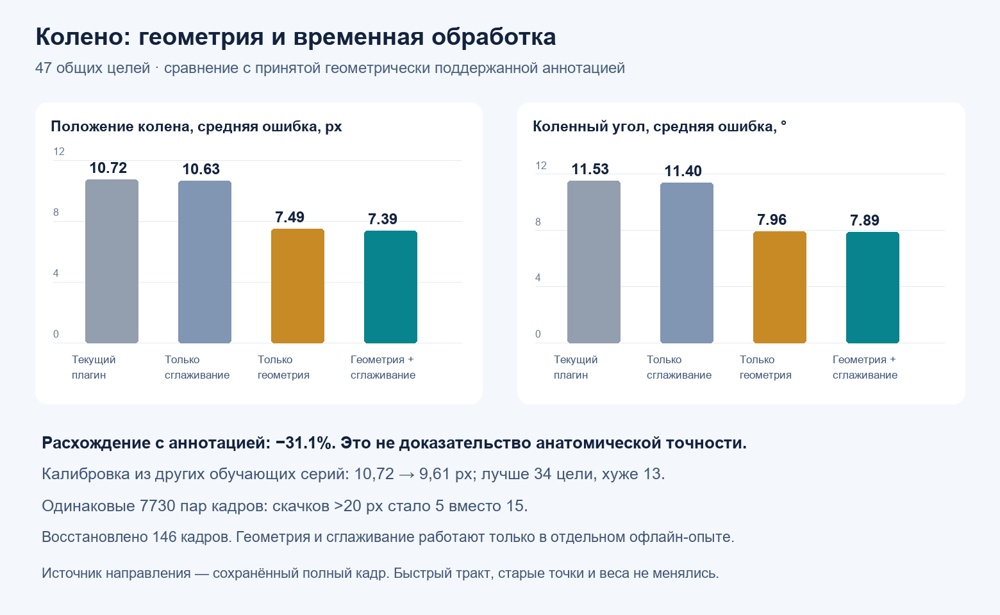
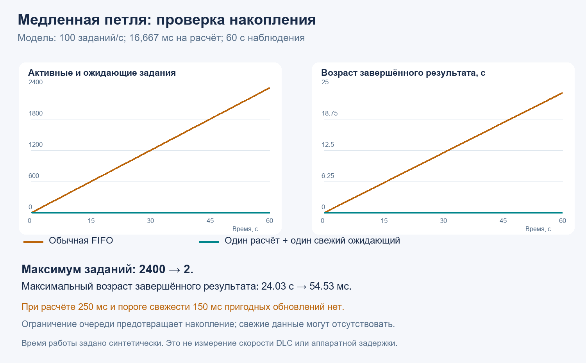
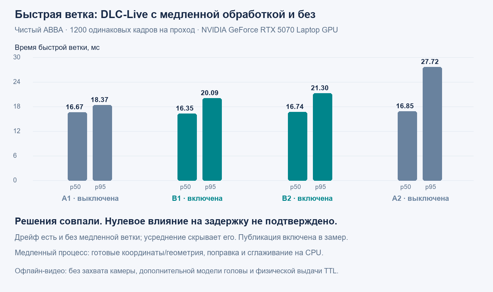

# Проверки v0.2.0-rc2 и исследования медленной обработки колена

**Статус: предварительный выпуск v0.2.0-rc2.** В рабочий конвейер добавлены необязательные точки `hl_knee_l` и `hl_knee_r` с обработкой штатным фильтром. Геометрическая коррекция, временная интерполяция и планировщик медленной петли ниже — **отдельные эксперименты; в live-контроллер они не встроены**. Снижение расхождения с разметкой на 31% не является улучшением, автоматически включённым в DLL этого выпуска.

Описание профиля, формата пакета и установки: [KNEES_V0_2_0.md](KNEES_V0_2_0.md). Код воспроизводимых синтетических экспериментов: [experiments/knee_slow_loop](../experiments/knee_slow_loop/README.md). Основные числа доступны в [JSON](validation/knee_20260928_summary.json).

## Модель и набор разметки

Проверки выполнялись с 17-точечной моделью ResNet50-GN: прежние 15 выходов и два колена. Исходный набор содержит **1349 кадров из 39 серий**, в том числе **1316 принятых ориентиров видимого колена**. Это число размеченных ориентиров, а не число животных или независимых испытаний. Разделение по сериям: 1081 обучающий и 268 проверочных кадров; надёжное соответствие серий отдельным животным не установлено.

Обучение выполнено на 150 эпохах; выбран checkpoint эпохи 50. Использовались предварительно обученный на ImageNet backbone и новая pose-head, без переноса прежней обученной pose-head. Старый pose-checkpoint уже видел часть кадров нового проверочного разделения. Новая модель поэтому не обязана воспроизводить прежние 15 выходов численно.

При обучении использовался полный кадр 1920×220 с нулевым дополнением до высоты 224; штатный live-профиль использует ROI 448×220. Это различие входных условий остаётся предметом дальнейшей проверки. Правила подготовки разметки описаны в [официальном руководстве DeepLabCut](https://deeplabcut.github.io/DeepLabCut/docs/beginner-guides/labeling.html), используемый live SDK — [DeepLabCut-live](https://github.com/DeepLabCut/DeepLabCut-live).

## Совместимость и намеренное исправление rc2

При подготовке публикации в отдельном окружении Python 3.10.11 прошли **80/80 Python-тестов плагина и 37/37 переносимых синтетических тестов**. Контрольные суммы runtime, модели и Release DLL совпадают с проверенной rc2; повторная сборка не выполнялась. Оба Python-набора включены в GitHub Actions.

Старые профили сохраняют шеститочечный пакет; профиль коленей передаёт восемь точек. При **одинаковых входных координатах внутри rc2** прежние шесть точек, выбор стороны, углы и дискретные выходы совпали для пакетов из шести и восьми точек. Полный повторный C++ replay 10 974 пакетов совпал с сохранённым состоянием rc2.

При этом rc2 намеренно исправляет общую медианную историю `filterPoint`, включая hip/ankle/toes: наблюдения с возрастом `>= median_window` удаляются, а разрешённое повторное обнаружение после длинного пропуска очищает историю. Ранее после потери точки могли возвращаться давно устаревшие координаты. После пропусков результат и производный угол могут отличаться от rc1. Проверка 6/8 точек **не означает** полной идентичности rc1 и rc2 или старой и новой нейросетей. Подробности и граничные случаи приведены в [описании коленей](KNEES_V0_2_0.md#исправление-повторного-обнаружения-в-rc2).

## Геометрия и сглаживание: офлайн

На одной записи из 10 974 кадров сравнивались исходный C++-результат и экспериментальная обработка колена. Оценка использовала **47 одинаковых кадров** с принятой геометрически поддержанной разметкой; остальные ориентиры не корректировались.

| Обработка | Среднее расстояние до принятой точки, px | Среднее расхождение коленного угла, ° |
|---|---:|---:|
| Текущий rc2 | 10,72 | 11,53 |
| Только временное сглаживание | 10,63 | 11,40 |
| Только мягкая геометрическая поправка | 7,49 | 7,96 |
| Геометрия и сглаживание | **7,39** | **7,89** |

Уменьшение расстояния на **31,1%** характеризует согласование с принятой разметкой, **не доказанную точность анатомического центра колена**. Разметка сама создавалась с помощью каркаса. Основная калибровка исключала текущую целевую точку и её попадание через соседние окна, но использовала другие точки той же серии. С калибровкой только из других обучающих серий результат скромнее: **10,72 → 9,61 px**; улучшились 34 из 47 целей, ухудшились 13. Перенос размеров между животными не подтверждён.

На одинаковых 7730 соседних парах кадров число скачков более 20 px уменьшилось с 15 до 5. Восстановлены 146 кадров коротких внутренних пропусков. Эти показатели не доказывают точность амплитуды или момента максимального сгибания. Направление каркаса получено из сохранённых full-frame предсказаний головы; организация этого входа в live ещё требуется.

## Ограничение накопления: синтетическая модель

За 60 с при 100 заданиях/с и заданной стоимости расчёта 16,667 мс:

| Показатель | Обычная FIFO | Один активный + один заменяемый ожидающий |
|---|---:|---:|
| Максимум активных и ожидающих заданий | 2400 | **2** |
| Максимальный возраст завершённого результата | 24,03 с | **54,53 мс** |
| Принято свежих результатов | 16 | 3598 |

Обе стратегии используют одинаковую проверку возраста/контекста после расчёта; FIFO всё равно вычисляет старые задания. Порог свежести 150 мс — **инженерное условие теста**, не физиологический допуск. При стоимости каждого расчёта 250 или 600 мс обе стратегии не дают ни одного пригодного обновления. При исчезновении входа на 5 с последняя принятая оценка стареет до 5,25 с, хотя каждый результат при принятии был свежим. Ограничение очереди не заменяет контроль отсутствия обновлений.

Выполнены 17 модульных тестов планировщика, 20 тестов численного прототипа и отдельные проверки конкурентного доступа и случайных сценариев. Синтетическая стоимость задачи не является измерением FPS DLC. Семикадровое окно ждёт три будущих кадра: 30 мс при непрерывных 100 Гц, 60 мс при 50 Гц; возраст определяется временными метками.

## Реальный DLC-Live и отдельный CPU-процесс

Четыре прохода **ABBA по одинаковым 1200 кадрам** выполнены на NVIDIA GeForce RTX 5070 Laptop GPU. A — медленная обработка выключена, B — отдельный CPU-процесс выполняет мягкую поправку и сглаживание. Быстрый шаг включает публикацию снимка. В B использованы текущие DLC-координаты и заранее рассчитанная геометрическая подсказка; второго GPU-инференса нет.

| Проход | A1 | B1 | B2 | A2 |
|---|---:|---:|---:|---:|
| p95 быстрого шага, мс | 18,368 | 20,087 | 21,297 | 27,716 |

ROI, маршрутизация, valid-флаги и рассчитанные TTL-слова совпали точно. Float32-координаты не полностью побитово одинаковы: максимальная разница **0,00001526 px** наблюдается также между A1 и A2. Нативные непрерывные координаты/углы имеют соответствующие малые различия; дискретное совпадение не подменяется заявлением полного численного равенства.

Относительно A1 p95 вырос на 1,719 мс / 9,36% в B1 и на 2,929 мс / 15,95% в B2. Оба превышают предварительный инженерный признак «более 1 мс и более 5%». Но A2 медленнее A1 на 9,348 мс, поэтому по этому запуску **нулевое влияние slow на задержку не подтверждено**, а вклад slow не отделён от дрейфа. Усреднение проходов этого не разрешает. Один первоначальный полный ABBA исключён из-за известного наложения стороннего CPU replay; выполнен один полный повтор без настройки алгоритма по результату.

В каждом B-проходе обработано 747 снимков, получено 408 конечных координат, из них 352 с геометрией. Максимальный возраст от начала обработки центрального кадра на хосте — 118,76 и 366,88 мс. Эти результаты только журналировались: стенд не принимал решения о свежести для управления стимуляцией.

## Границы результатов

Это исследовательские проверки перед дальнейшей интеграцией. Последовательный replay сохраняет каждый номер исходного кадра; live-камера с `NEWEST_ONLY` может давать нерегулярные пропуски, на которых текущий численный прототип сбрасывает окно. Доступность медленных выходов при таком потоке ещё не доказана. Построение окружностей, live-направление головы, ЭМГ и подбор стимуляции не входили в ABBA-нагрузку.

C++ replay выполнен отдельно после инференса. Угловые TTL-биты упражнялись программным fixture 179°; это не установленная экспериментальная настройка. Захват камеры, работа полного Open Ephys-контура, физический TTL/ток и задержка камера→электрод не измерены. Синтетические проверки можно повторить из [каталога экспериментов](../experiments/knee_slow_loop/README.md); исходные видеозаписи, изображения животных, ручная разметка и локальные журналы в этот отчёт не включены.
